<h3><code>amanbol@github ~ $ ./contributions.sh</code></h3>

  

<h3><code>amanbol@github ~ $ whoami</code></h3>

<table>
  <tr>
    <td valign="top"></td>
    <td valign="top"></td>
  </tr>
</table>

 

<h3><code>amanbol@github ~ $ ls ./projects</code></h3>

<!-- PROJECTS:START -->
<!-- populated automatically by scripts/update_projects.py -->
<!-- PROJECTS:END -->

 

<h3><code>amanbol@github ~ $ ./connect.sh</code></h3>

  

<code>~ built with SVG + a daily GitHub Action · no trackers, no tokens ~</code>

